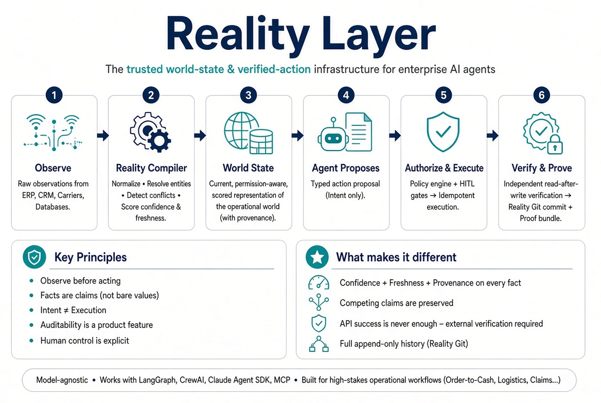

# Reality Layer

A current, verified, permission-aware representation of the operational world for AI
agents — plus a controlled path from an agent's intent to an externally verified result.

Two core systems:

- **Reality Compiler** — turns raw observations and agent activity into structured, scored,
  queryable world state.
- **Reality Git** — append-only history, diffs, provenance, decisions, actions, and proofs
  of how that world changed.

Model-independent. Designed for LangGraph, CrewAI, Claude Agent SDK, MCP clients, and
custom orchestrators.



## Status

Investor MVP prototype. All nine build-plan phases are functionally complete against the
local fallback path: a working Order-to-Cash control loop with tenant-scoped observations,
World State projections, typed action proposals, default-deny policy evaluation,
precondition revalidation, idempotent Shopify test-adapter execution, independent
read-after-write verification, hash-linked action/commit events, proof bundles, bounded
verifier-worker polling, optional PostgreSQL persistence, an in-process MCP adapter, a
read-only operator dashboard (served at `/`), a scripted agent demo (`reality demo`), and
durable `observe_only` <-> `demo_proposal` workspace mode transitions.

Post-MVP, a Phase 9 has also landed: cross-source conflict detection on World State
attribute merge, a `GET/POST /v1/conflicts` API, and a policy gate that denies proposals
against an entity with an unresolved conflict, surfaced through a `reality conflicts` CLI
and `list_conflicts`/`get_conflict`/`resolve_conflict` MCP tools. Conflicts are
Postgres-backed (a `conflict` table) when persistence is enabled, so they survive
process restarts and are shared across workers.

The following remain partial or planned: field-level permission filtering and ABAC,
durable HITL expiry/delegation/supersession, an agent SDK, complete connector
persistence, live Shopify/EasyPost validation, a live dress rehearsal, Railway
deployment with a persistent PostgreSQL volume, and signed attestations. REST is the
canonical interface; a network-addressable MCP server (`reality mcp-server`) exposes the
same adapter tools over stdio, SSE, or streamable-HTTP, optionally pointed at a running
`reality serve` deployment via `--api-url`.

The product contract requires new workspaces to start in `observe_only` mode. With
persistence enabled an operator enables proposals explicitly (`reality workspace --mode
demo_proposal` or `POST /v1/workspace/mode`); without persistence the runtime falls back
to a `REALITY_WORKSPACE_MODE` setting.

## Development

```bash
python -m pip install -e ".[dev]"
pytest
```

Run the credential-free end-to-end rehearsal against the deterministic local Shopify
adapter:

```bash
reality rehearse
```

Use `--runs 5` to verify that repeated local rehearsals remain isolated and reset-safe.
Use `--output artifacts/rehearsal-proof.json` to save a static fallback proof bundle.
Use `--summary` to save or print a compact machine-readable rehearsal result.
Use `reality preflight` to gate the live demo on required connector capabilities.
Use `reality mcp-server` to run a network-addressable MCP server exposing the same
adapter tools (`--api-url` points it at a running `reality serve` deployment instead
of an in-process app; `--transport` selects `stdio`, `sse`, or `streamable-http`).

PostgreSQL persistence coverage is opt-in and expects a disposable database:

```bash
REALITY_TEST_DATABASE_URL=postgresql+psycopg://... pytest tests/integration
```

## Docs

| Doc | Purpose |
| --- | --- |
| [`docs/reality-layer-technical-architecture.md`](docs/reality-layer-technical-architecture.md) | Full v2.0 technical architecture |
| [`docs/mvp-design.md`](docs/mvp-design.md) | MVP scope, build plan, and technical decisions |
| [`docs/demo-runbook.md`](docs/demo-runbook.md) | Local fallback and live demo operating procedure |

## MVP at a glance

One end-to-end loop for the Order-to-Cash vertical:

```
real source → immutable observation → compile → World State + commit
  → agent reads state → proposes typed action → policy decision
  → (optional HITL approval) → execute with idempotency
  → verify externally → new commit + proof bundle
```
